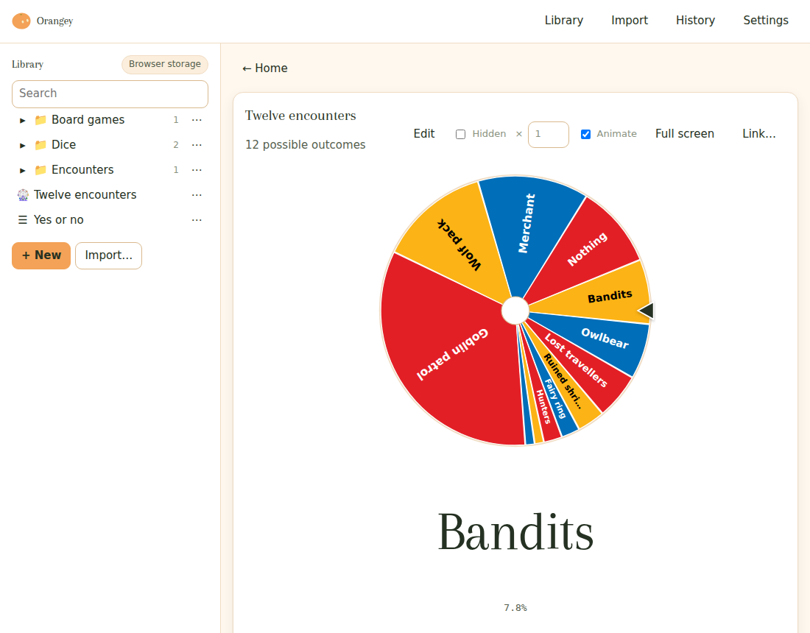
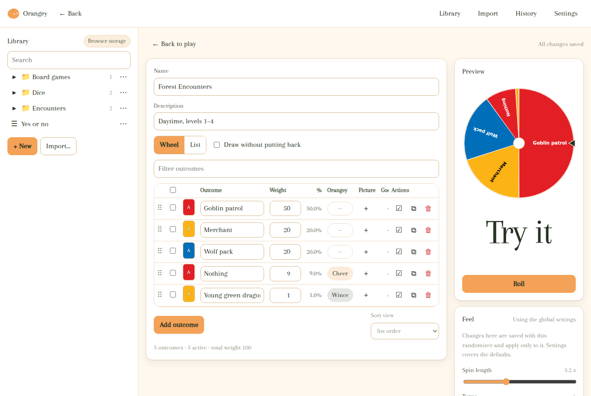
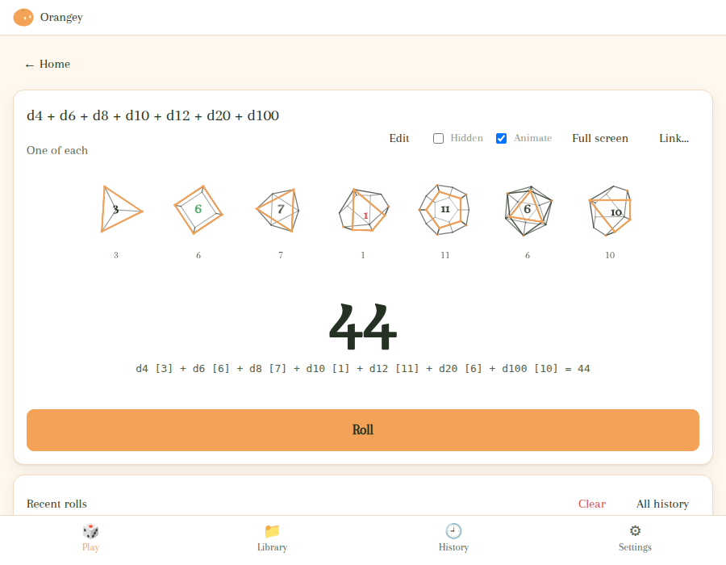
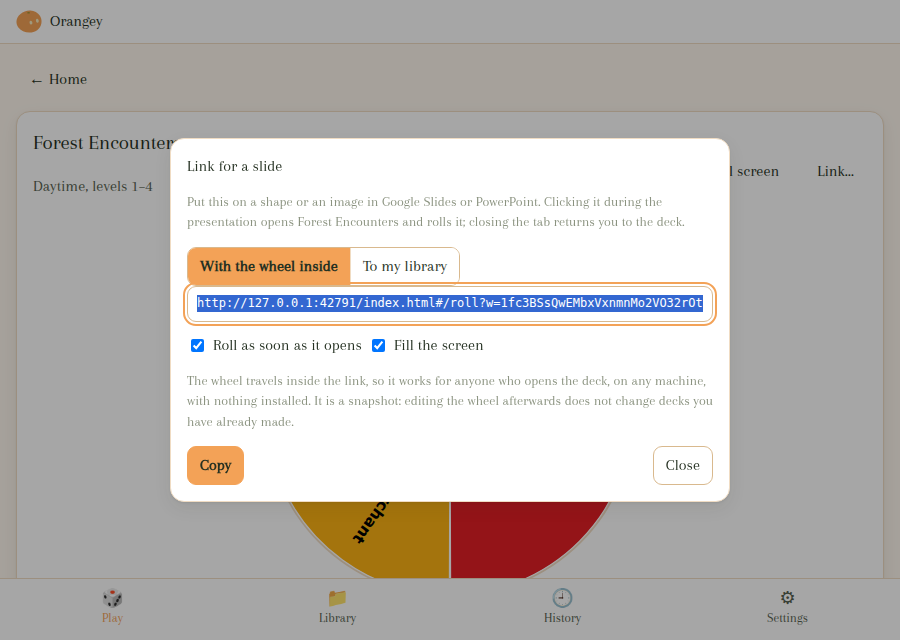
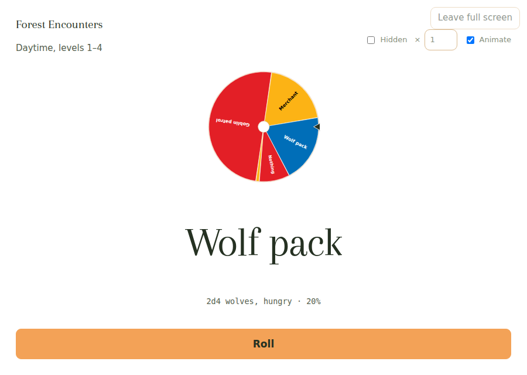

# Orangey

A randomizer for tabletop games: dice, coins, numbers, and weighted wheels you
build from your own tables. It runs entirely in your browser, needs no account
and no server, works offline, and keeps your wheels as ordinary JSON files that
you can copy, share, back up or keep in Git.







## Try it

**[orangey-app.github.io/orangey](https://orangey-app.github.io/orangey/)** —
that is the whole installation. On a phone or on a desktop, your browser will offer to install it
as an app; say yes and it gets its own icon and opens without a browser bar.

Or keep a copy: **[orangey.html](https://orangey-app.github.io/orangey/orangey.html)**
is the whole app in one file that opens from your own disk, with no server and
no network. It is also under **Settings → About → Download**, and attached to
every [release](https://github.com/orangey-app/orangey/releases).

There is nothing to install and nothing to sign up for. The first time you open
it, it works; every time after that, it works with the network switched off.

## What it does

**Dice.** `d20`, `2d6 + 3`, `4d6kh3`, `2d20kh1` for advantage — the notation is
in [docs/DICE.md](docs/DICE.md). Dropped dice are shown struck through, not
silently removed. Two styles: plain numbered squares, or wireframe solids — a
tetrahedron for a d4, a cube for a d6, an octahedron, a pentagonal
trapezohedron for the ten-siders, a dodecahedron, an icosahedron — that tumble
about their own diagonals, change axis at every bounce, and come to rest with
the face they are showing turned square-on, its number sized to sit inside it.

**Wheels.** A list of outcomes with weights. Weights are just numbers and
Orangey normalizes them, so `50/30/20` and `5/3/2` are the same wheel and
nothing has to add up to 100. Segments take up the space their weight deserves.

**Import.** Paste or drop a table — commas, semicolons, tabs, pipes and aligned
columns are all detected — map the columns, read a report of exactly what will
happen, and land in the editor with the table ready to fix:

```
✓ 24 entries ready
✓ Weights valid (total 340)
⚠ 2 entries have no description
⚠ 1 duplicate label: "Wolf pack" (rows 7, 19) — kept both
✗ 1 entry has an invalid weight: row 12 "many" — will be skipped
```

**Your own feel per randomizer.** Every randomizer's editor has a Feel card
for its own type — spin length, turns, wind-down and roll-back for a wheel;
style, tumble, bounces and scatter for dice; flips, length and toss height for
a coin — saved with the randomizer and merged over the global settings. An
**Animate** switch beside Roll turns motion off for the evening without
touching any of it.

**Editing.** Every outcome can be disabled (kept in the list, out of the roll,
weight preserved), duplicated or deleted, in place. Deletions are undoable for
ten seconds. Rows can be reordered by dragging or with `Alt + ↑ / ↓`.

**Nothing is spoiled.** The result is decided the moment you press Roll — that
is what makes skipping safe — but nothing shows it until the animation lands.
The dice tumble through values that are not the answer and settle onto the real
ones; the wheel and coin keep their own counsel; the reveal and the
screen-reader announcement happen together, at the landing.

**Feel.** The wheel eases in and out and swings past its target by a random
share of a roll-back you set; the coin is tossed along an arc, shrinking as it
goes away; the dice fly in from one point, scatter, and land in order. All of
it adjustable in Settings with a preview beside each control. Five colour
schemes, from the brand's warm cream and orange to Night on the brand black.

**Orangey himself.** The mascot can sit by the result — or stay out of the
way until something happens. A maximum roll makes him cheer, a minimum makes
him wince, and so does a slide link that points at a wheel this browser does
not have. A wheel has no natural top or bottom, so you tag its outcomes
instead: an **Orangey** cell on every row of the editor (and under each coin
face) says whether he cheers or winces when that one comes up. Whether he
appears at all is the game master's call, in Settings, along with how much he
wobbles and which things he reacts to. However much he wobbles, at rest he is
exactly the drawing.

**Your colours, your settings.** Add colours of your own to the palette — from
Settings or straight from the colour picker — and they come first in every
picker. Save all your settings (scheme, feel, Orangey, seed, colours) as one
small file and load it on another device.

**Everything stays here.** No account, no telemetry, no analytics, no
third-party requests. After the page loads, Orangey makes no network requests
at all.

## Using it with Google Slides or PowerPoint

If you run games from a deck, you can put a link on the slide itself. Open the
randomizer, press **Link…**, and paste what it gives you onto a shape or an
image — a die icon on the map, a button next to the encounter table. Clicking
it during the presentation opens that wheel, rolls it, and fills the screen;
closing the tab puts you back on the slide.

The link addresses the randomizer by its identity rather than its file name, so
renaming a wheel or moving it to another folder will not break a deck you made
months ago.





There are two kinds of link, offered side by side. **With the wheel inside**
carries the randomizer in the address itself, so the deck works for anyone who
opens it, on any machine, with nothing installed — and it keeps rolling the
same wheel whatever you do to your library afterwards. **To my library** is
short and follows every edit you make, but only works on a device where that
library is stored. A wheel that arrives in a link can be rolled without being
kept, or saved to your library; pasting one into the Import page offers the
same choice.

Two things worth knowing about the library kind. The link has to point at a hosted copy of Orangey —
browsers refuse to follow a link from a web page to a file on your disk, so a
deck cannot open a downloaded `orangey.html`; the dialog tells you when the
copy you are using cannot be linked to. And a link to your own library only
works on a device where that library is stored: someone else opening your deck
will be told the wheel is not in their browser — which is exactly what the
other kind of link is for.

Neither Google Slides nor PowerPoint can host a live, clickable randomizer on
the slide itself: Slides has no way to embed live web content at all, and a
PowerPoint content add-in stops taking clicks the moment you start presenting.
A hyperlink is the mechanism that actually works in presentation mode, on both.

## Your library is a folder of files

```
D&D/
  Encounters/
    forest-encounters.orangey.json
    dungeon-encounters.orangey.json
  Treasure/
    minor-treasure.orangey.json
Pathfinder/
  NPCs/
    npc-names.orangey.json
```

By default that folder lives in your browser's own storage — including when
you open a downloaded `orangey.html` straight from disk. In browsers that
support it, the storage badge in the library offers **Use a folder on this
computer…**, which points Orangey at a real folder instead — then Dropbox,
Nextcloud or Git can sync it like any other files, and the folder is
remembered next time. The same badge exports the whole tree as a ZIP, and the
Import page takes that ZIP back, along with spreadsheets and single
`.orangey.json` files. Randomizers can be dragged between folders.

The format is documented in [docs/FORMAT.md](docs/FORMAT.md); there are
examples in [`examples/`](examples).

## A first run

1. Open Orangey.
2. Press **Import** and drop `examples/dnd/forest-encounters.csv` on the page.
3. Check the report, press **Create and edit**.
4. Set the dragon's weight to `1`, disable the merchant for now, press **Roll**.
5. Reload the page. It is still there.

## Keyboard

| | |
|---|---|
| `Space` / `Enter` | roll |
| `Esc` | skip the animation |
| `/` | search the library |
| `?` | all shortcuts |
| `Alt + ↑ / ↓` | reorder an outcome |
| `Ctrl/Cmd + D` | duplicate an outcome |
| `Ctrl/Cmd + Z` | undo the last deletion |

Everything is reachable from the keyboard, results are announced to screen
readers as text, and nothing is conveyed by colour alone.

## Development

No dependencies. Node 22.6 or newer, because the build uses Node's own
TypeScript type stripping.

```sh
npm run check         # bundle, lint the rules the project depends on
npm test              # unit tests (node --test)
npm run build         # dist/ as a static site
npm run build:single  # also dist/orangey.html, one self-contained file
npm run test:browser  # drive the built app in headless Chromium
```

[docs/ARCHITECTURE.md](docs/ARCHITECTURE.md) explains the layout, the rules the
code depends on, and why there is no framework.

## Licence

The software is MIT. **Orangey himself is not**: the mascot — the drawings in
`assets/mascot/`, the geometry in `src/ui/mascot/parts.ts`, the icon, and the
same artwork inside any built file — is © 2026 Amogh Kinikar, all rights
reserved. You may run, fork and redistribute the app with him in it, as he is,
as its mascot; you may not reuse, alter or redistribute the character on its
own. A fork that wants a different mascot removes `assets/mascot/` and
`src/ui/mascot/` and still builds. The full terms are in [LICENSE](LICENSE).
