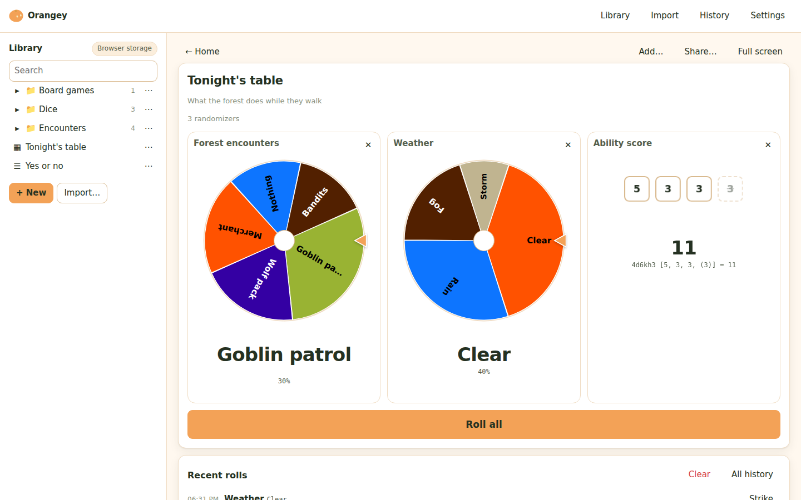
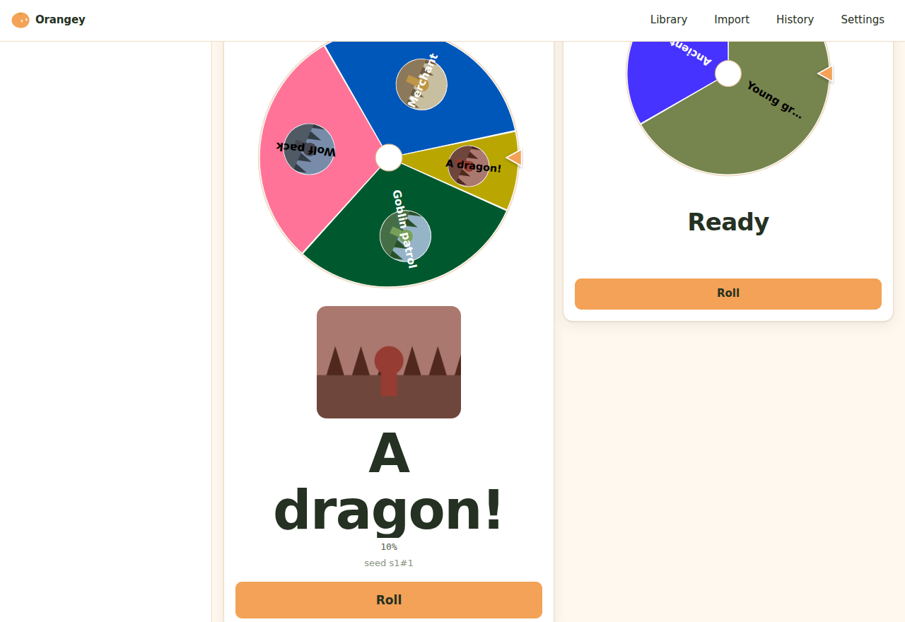

# Orangey

A randomizer for tabletop games: dice, coins, numbers, and weighted wheels you
build from your own tables. It runs entirely in your browser, needs no account
and no server, works offline, and keeps your wheels as ordinary JSON files that
you can copy, share, back up or keep in Git.






**Outcomes can carry pictures.** A portrait on an encounter shows in its
slice in place of the name, and fills the screen above the answer when it
comes up. **Slices show** in the editor switches a wheel to names, or to both
side by side.
Pictures live beside your library rather than inside the randomizer's file, and
they travel with an export — but never inside a shared link, which is what
keeps links short.

**An outcome can send you to another randomizer.** Set "Goes to" on an outcome
and rolling it opens that randomizer beside the wheel, waiting for its own
press. Chains keep the newest two in view and turn the rest into icons. On a
board, the randomizer it opens appears as a dashed cell right after the one
that sent you there.

**Boards** put several randomizers on one screen: an encounter table, the
weather and an attack roll side by side, each with its own answer. Roll all
spins everything at once, or a cell's own Roll rolls just that one. **Edit
board** is where cells are added, removed and reordered — a stray click at the
table cannot change the board — and Add… also takes dice notation, so typing
`2d6 + 3` puts that roll straight on the board. A board is a file
in your library like anything else, and it points at your randomizers rather
than copying them, so editing a table updates every board it is on. Share… on
a board gives you a link that opens it here, and a download that packs the
board together with everything on it — that archive is how a board goes to
someone else. For something needed just tonight, the box above the cells
takes dice (`3d20`) and **Quick wheel** makes a wheel typed in its own cell:
both sit on the board until you close them, without changing it, and
**Save to library** keeps one and puts it on the board for good.

## Try it

**[orangey-app.github.io/orangey](https://orangey-app.github.io/orangey/)** —
that is the whole installation. On a phone or on a desktop, your browser will offer to install it
as an app; say yes and it gets its own icon and opens without a browser bar.

Or keep a copy: **[orangey.html](https://orangey-app.github.io/orangey/orangey.html)**
is the whole app in one file that opens from your own disk, with no server and
no network. It is also under **Settings → About → Download**, and attached to
every [release](https://github.com/orangey-app/orangey/releases).

There is nothing to install and nothing to sign up for. The first time you open
it, it works; every time after that, it works with the network switched off.

## What it does

**Dice.** `d20`, `2d6 + 3`, `4d6kh3`, `adv` and `dis`, exploding dice (`3d6!`),
rerolls (`4d6r1`), success pools (`5d10>=8`) and Fate dice (`4dF`) — the
notation is in [docs/DICE.md](docs/DICE.md). An outcome can carry dice in its
text: "{2d4} wolves" rolls the 2d4 when that outcome comes up. Dropped dice are
shown faded, not silently removed, and explosions and rerolls land in throws
of their own after the first. Two styles: plain numbered squares, or
wireframe solids — a tetrahedron for a d4, a cube for a d6, an octahedron, a
pentagonal trapezohedron for the ten-siders, a dodecahedron, an icosahedron —
that tumble about their own diagonals, change axis at every bounce, and come
to rest with the face they are showing turned square-on, its number sized to
sit inside it.

**Wheels.** A list of outcomes with weights. Weights are just numbers and
Orangey normalizes them, so `50/30/20` and `5/3/2` are the same wheel and
nothing has to add up to 100. Segments take up the space their weight deserves.
**Draw without putting back** turns a wheel into a bag: what came up stays out
until the bag is empty. The **×** beside Roll draws several at once, and
**Hidden** rolls behind the screen — the answer waits until you choose to
reveal it. **Offer … to choose from** makes a wheel deal that many different
outcomes as cards, and the one the player takes is the outcome: "here are
three hooks, take one".

**Quick wheel.** On the home screen, type the options one per line — `| 3` or
`x3` after a line weighs it — and the wheel follows as you type. It rolls at
once, it survives the phone locking, and it is gone when you press a preset
unless you save it to your library.

**Import.** Paste or drop a table — commas, semicolons, tabs, pipes and aligned
columns are all detected — map the columns, read a report of exactly what will
happen, and land in the editor with the table ready to fix. Printed d100
tables work as they are: `01–65`, `66–85`, `00` become weights. Any list goes
back out as CSV from its menu in the library.

```
✓ 24 entries ready
✓ Weights valid (total 340)
⚠ 2 entries have no description
⚠ 1 duplicate label: "Wolf pack" (rows 7, 19) — kept both
✗ 1 entry has an invalid weight: row 12 "many" — will be skipped
```

**Your own feel per randomizer.** Every randomizer's editor has a Feel card
for its own type — spin length, turns, wind-down and roll-back for a wheel;
style, tumble, bounces and scatter for dice; flips, length and toss height for
a coin — saved with the randomizer and merged over the global settings. An
**Animate** switch beside Roll turns motion off for the evening without
touching any of it.

**Editing.** Every outcome can be disabled (kept in the list, out of the roll,
weight preserved), duplicated or deleted, in place. Deletions are undoable for
ten seconds — an outcome, a randomizer from the library, or a cell taken off a
board. Rows can be reordered by dragging or with `Alt + ↑ / ↓`.

**History.** Every roll is kept with its date and time, the dice behind a
total, and, for a chained roll, what sent you there. Strike a roll that did
not count, repeat one with a press, and export the lot as CSV or text. The
last few rolls also sit under the result as **Recent rolls**, and the home
screen keeps your favourites and the randomizers you rolled lately one press
away.

**Nothing is spoiled.** The result is decided the moment you press Roll — that
is what makes skipping safe — but nothing shows it until the animation lands.
The dice tumble through values that are not the answer and settle onto the real
ones; the wheel and coin keep their own counsel; the reveal and the
screen-reader announcement happen together, at the landing.

**Feel.** The wheel eases in and out and swings past its target by a random
share of a roll-back you set; the coin is tossed along an arc, shrinking as it
goes away; the dice fly in from one point, scatter, and land in order. All of
it adjustable in Settings with a preview beside each control. Five colour
schemes, from the brand's warm cream and orange to Night on the brand black.

**Your own theme.** Pick a background, a text colour, an accent and the
wheel's colours in Settings; everything else — cards, borders, faint text,
button ink — is worked out from them, and a preview shows the result. Anything
hard to read is listed with its contrast as you pick, and the closest readable
version appears beside yours: the same hues, nudged as little as will do. A
wheel can also have colours of its own, set in its editor; those travel with
it, in its file and in a link.

**Orangey himself.** The mascot can sit by the result — or stay out of the
way until something happens. A maximum roll makes him cheer, a minimum makes
him wince, and so does a slide link that points at a wheel this browser does
not have. A wheel has no natural top or bottom, so you tag its outcomes
instead: an **Orangey** cell on every row of the editor (and under each coin
face) says whether he cheers or winces when that one comes up. Whether he
appears at all is the game master's call, in Settings, along with how much he
wobbles and which things he reacts to. However much he wobbles, at rest he is
exactly the drawing.

**Your colours, your settings.** Add colours of your own to the palette — from
Settings or straight from the colour picker — and they come first in every
picker. Save all your settings (scheme, feel, Orangey, seed, colours) as one
small file and load it on another device. Your own theme travels in it too.

**Everything stays here.** No account, no telemetry, no analytics, no
third-party requests. After the page loads, Orangey makes no network requests
at all.

## Using it with Google Slides or PowerPoint

If you run games from a deck, you can put a link on the slide itself. Open the
randomizer, press **Link…**, and paste what it gives you onto a shape or an
image — a die icon on the map, a button next to the encounter table. Clicking
it during the presentation opens that wheel, rolls it, and fills the screen;
closing the tab puts you back on the slide. While it fills the screen it keeps
the screen awake.

The link addresses the randomizer by its identity rather than its file name, so
renaming a wheel or moving it to another folder will not break a deck you made
months ago.


There are two kinds of link, offered side by side. **With the wheel inside**
carries the randomizer in the address itself, so the deck works for anyone who
opens it, on any machine, with nothing installed — and it keeps rolling the
same wheel whatever you do to your library afterwards. **To my library** is
short and follows every edit you make, but only works on a device where that
library is stored. A wheel that arrives in a link can be rolled without being
kept, or saved to your library; pasting one into the Import page offers the
same choice.

Two things worth knowing about the library kind. The link has to point at a hosted copy of Orangey —
browsers refuse to follow a link from a web page to a file on your disk, so a
deck cannot open a downloaded `orangey.html`; the dialog tells you when the
copy you are using cannot be linked to. And a link to your own library only
works on a device where that library is stored: someone else opening your deck
will be told the wheel is not in their browser — which is exactly what the
other kind of link is for.

Neither Google Slides nor PowerPoint can host a live, clickable randomizer on
the slide itself: Slides has no way to embed live web content at all, and a
PowerPoint content add-in stops taking clicks the moment you start presenting.
A hyperlink is the mechanism that actually works in presentation mode, on both.

## Your library is a folder of files

```
D&D/
  Encounters/
    forest-encounters.orangey.json
    dungeon-encounters.orangey.json
  Treasure/
    minor-treasure.orangey.json
Pathfinder/
  NPCs/
    npc-names.orangey.json
```

By default that folder lives in your browser's own storage — including when
you open a downloaded `orangey.html` straight from disk. In browsers that
support it, the storage badge in the library offers **Use a folder on this
computer…**, which points Orangey at a real folder instead — then Dropbox,
Nextcloud or Git can sync it like any other files, and the folder is
remembered next time. On an iPhone or iPad no browser can use a folder, and
Safari clears the storage of a site left unopened for about a week: add
Orangey to your Home Screen and export a ZIP now and then. The same badge
exports the whole tree as a ZIP, and the Import page takes that ZIP back,
along with spreadsheets and single `.orangey.json` files. Randomizers can be
dragged between folders.

The format is documented in [docs/FORMAT.md](docs/FORMAT.md); there are
examples in [`examples/`](examples).

## A first run

1. Open Orangey.
2. Press **Import** and drop `examples/dnd/forest-encounters.csv` on the page.
3. Check the report, press **Create and edit**.
4. Set the dragon's weight to `1`, disable the merchant for now, press **Roll**.
5. Reload the page. It is still there.

## Keyboard

| | |
|---|---|
| `Space` / `Enter` | roll (on a board, roll all) |
| `Esc` | skip the animation |
| `/` | search the library |
| `?` | all shortcuts |
| `Delete` / `F2` | delete or rename the focused entry in the library |
| `Alt + ↑ / ↓` | reorder an outcome |
| `Ctrl/Cmd + D` | duplicate an outcome |
| `Ctrl/Cmd + Z` | undo the last deletion |

Everything is reachable from the keyboard, results are announced to screen
readers as text, and nothing is conveyed by colour alone.

## Development

The shipped app has no dependencies, and building it needs nothing but Node
22.6 or newer, because the build uses Node's own TypeScript type stripping.
The one dev dependency is TypeScript itself, used only by `npm run typecheck`.

```sh
npm install           # only needed for typecheck; nothing else uses it
npm run check         # bundle, lint the rules the project depends on
npm run typecheck     # tsc --strict over src/ (needs npm install first)
npm test              # unit tests (node --test)
npm run build         # dist/ as a static site
npm run build:single  # also orangey.html, one self-contained file, at the
                      # repository root (committed) and in dist/
npm run test:browser  # drive the built app in headless Chromium
npm run screenshots   # retake docs/screenshot-*.png from the built app
```

`check`, `test` and the builds need only Node, so a clean checkout can build
the app without installing anything.

[docs/ARCHITECTURE.md](docs/ARCHITECTURE.md) explains the layout, the rules the
code depends on, and why there is no framework.

## Licence

The software is MIT. **Orangey himself is not**: the mascot — the drawings in
`assets/mascot/`, the geometry in `src/ui/mascot/parts.ts`, the icon, and the
same artwork inside any built file — is © 2026 Amogh Kinikar, all rights
reserved. You may run, fork and redistribute the app with him in it, as he is,
as its mascot; you may not reuse, alter or redistribute the character on its
own. A fork that wants a different mascot removes `assets/mascot/` and
`src/ui/mascot/` and still builds. The full terms are in [LICENSE](LICENSE).

Two fonts are built in, both under the SIL Open Font License 1.1: **Arapey**
by Eduardo Tunni, for names, headings and answers, and the digits of
**Young Serif** by Bastien Sozeau, for the numbers on dice. The font files and their
licence texts are in `assets/fonts/`, and the build carries the licences
into every built file.
